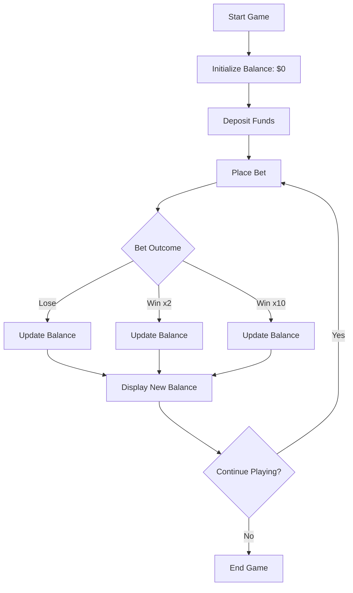

# Diva Dynasty

**Diva Dynasty** is a console application that provides a fun and engaging casino experience designed with female players in mind. The heart of this experience is the **Wallet**, which allows players to manage their funds, place bets, and enjoy a simple yet thrilling slot game.

## Features

- **Initial Balance**: Players begin with a starting balance of **$0**.
- **Money Deposit**: Players can deposit funds into their wallet to increase their balance.
- **Money Withdrawal**: Players can withdraw funds from their wallet, reducing their balance.
- **Placing Bets & Accepting Wins**: Players can place bets within a specific range and engage in a simple slot game.

## Game Rules

- **Betting Range**: Bets must be between **$1** and **$10**.
- **Outcome Probabilities**:
  - **50%** of bets result in a loss.
  - **40%** of bets win up to **2x** the bet amount.
  - **10%** of bets win between **2x** and **10x** the bet amount.
- **Balance Calculation**: After each round, the player’s balance is updated based on the formula: new balance = old balance - bet amount + win amount

- **Game End**: The game concludes when the player chooses to stop playing.

## How It Works

The flow of the game is outlined in the diagram below:

